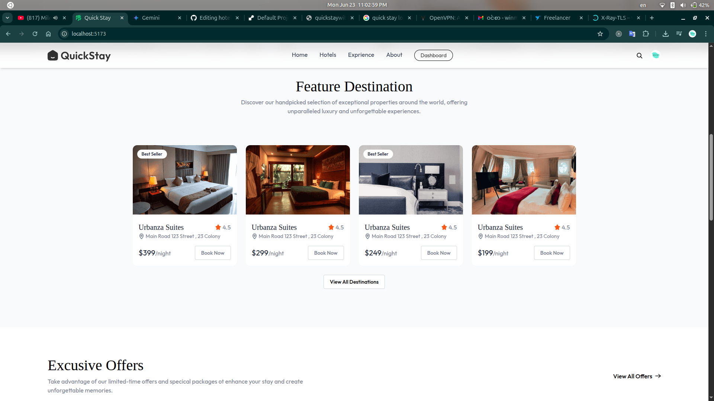

# Hotel & Room Management System (Frontend)


This repository contains the frontend for a modern and responsive room management system. It is built entirely with **React** and styled with **Tailwind CSS**.

**Important Note:** Currently, this is a **frontend-only** application. All data is static and loaded from local dummy files for demonstration purposes. The goal is to showcase the user interface and user experience before connecting it to a live backend API.

A responsive and modern web application designed for property owners to efficiently manage their room listings. This project features a powerful owner-facing dashboard to add new rooms, view all listings, and update room availability in real-time.

**Live Demo:** [Demo](https://quickstaywithus.onrender.com)


---

## 📸 Screenshots

*(It's highly recommended to add screenshots of your application here!)*

| Room List View | Features|
| :-------------: | :--------------: |
|  |  |


---

## ✨ Key Features

* **Admin Sidebar Navigation**: Easy navigation between Dashboard, Add Room, and List Room pages using React Router.
* **Dynamic Room Listing**: View all rooms from a static data source in a clean, organized table.
* **Interactive Availability Toggle**: A functional UI toggle to demonstrate how an admin would update room availability.
* **Responsive Design**: The UI is fully responsive, adapting seamlessly from large desktop screens to mobile devices.
* **Component-Based Architecture**: Built with reusable React components for maintainability and scalability.

---

## 🛠️ Built With

This project is built using modern frontend technologies:

* [React.js](https://reactjs.org/) - A JavaScript library for building user interfaces.
* [React Router](https://reactrouter.com/) - For client-side routing and navigation.
* [Tailwind CSS](https://tailwindcss.com/) - A utility-first CSS framework for rapid UI development.

---

## 🚀 Getting Started

To get a local copy up and running, follow these simple steps.

### Prerequisites

Make sure you have Node.js and npm installed on your machine.
* `npm`
    ```sh
    npm install npm@latest -g
    ```

### Installation

1.  **Clone the repository**
    ```sh
    git clone [https://github.com/your-username/your-repository-name.git](https://github.com/your-username/your-repository-name.git)
    ```
2.  **Navigate to the project directory**
    ```sh
    cd your-repository-name
    ```
3.  **Install NPM packages**
    ```sh
    npm install
    ```
4.  **Run the development server**
    ```sh
    npm run dev
    ```
    The application will be available at `http://localhost:5173` (or another port specified in your console).

---

## 🔮 Future Goals (Roadmap)

The vision for this project is to evolve it into a full-stack application. The next steps include:
* [ ] **Build a REST API**: Develop a backend server using Node.js and Express.js to manage data.
* [ ] **Integrate a Database**: Use a database like MongoDB to store room, user, and booking information persistently.
* [ ] **Connect Frontend to API**: Replace the static dummy data with live data fetched from the new API.
* [ ] **Implement User Authentication**: Add login and registration functionality for both admins and guests.
